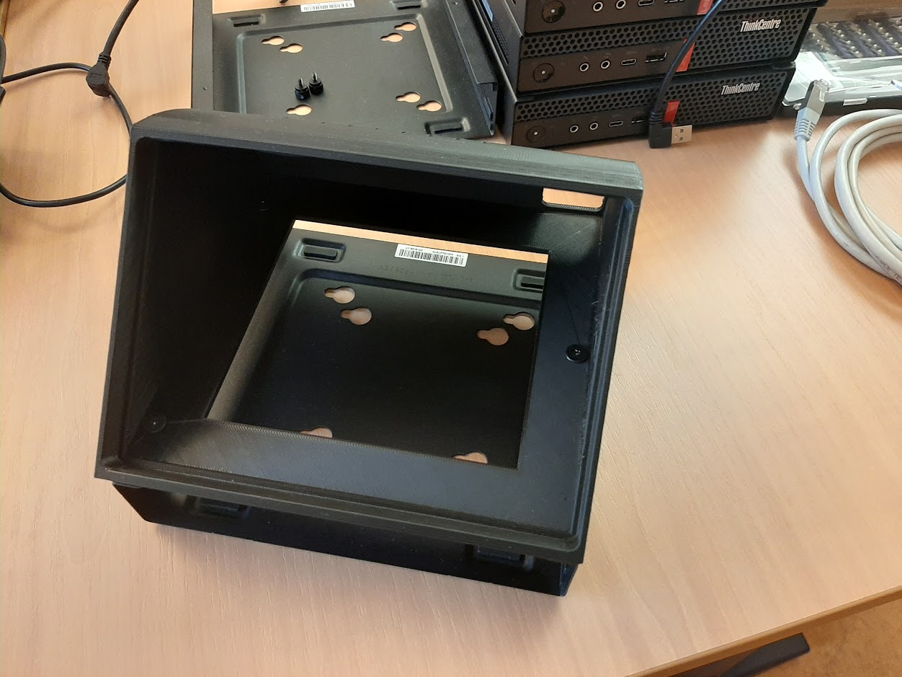
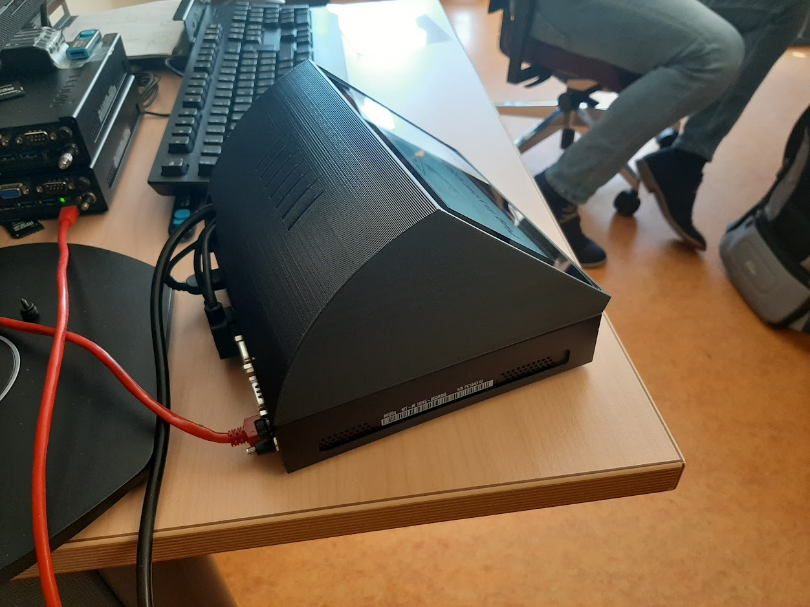
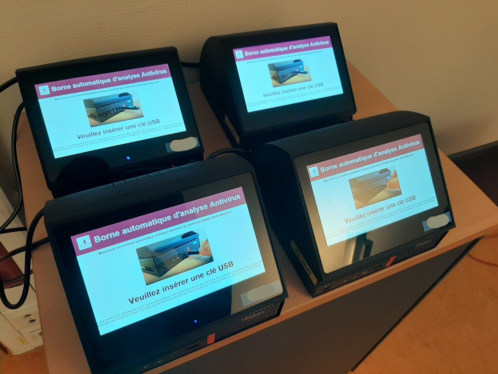

Pandora-box
============

Pandora-Box is a USB scaning station based on [Pandora](https://github.com/pandora-analysis).
It runs on Ubuntu 22.04 server LTS

It is based on recycled ThinkCenter and an integrated HDMI touch screen.

## Interface

It has a graphic user interface :

and a text user interface for advanced users :

## Roadmap

If you want to contribute, we have a [roadmap](ROADMAP.md).

## Installation

The [installation and configuration procedure](INSTALL.md) is documented.

## License

Pandora-box is an open source software distributed under [GPL](https://www.gnu.org/licenses/licenses.html).

# Troubleshooting

Update Pandora

    poetry run update --yes
	
	
Check Pandora listening on port 6100

    sudo lsof -i -P -n | grep LISTEN

Result should contains 

    ...
    gunicorn: 1034         pandora    5u  IPv4  27043      0t0  TCP *:6100 (LISTEN)
    ...

Test submit a file to Panra with command line

    poetry run pandora --url http://127.0.0.1:6100 -f <<file_name>>
	
Look a the Pandora logs files

    tail -500f /var/log/pandora_message.log
    tail -500f /var/log/pandora_error.log

Look a the Pandora-box logs files

    tail -500f /var/log/pandora-box.log

