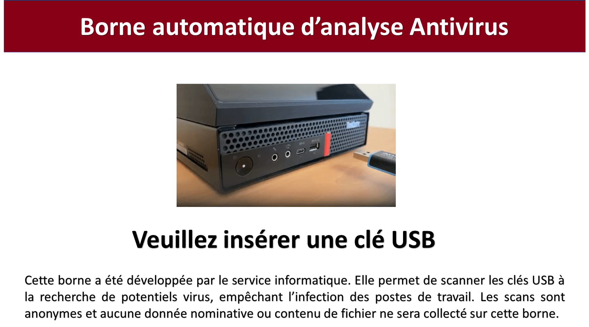
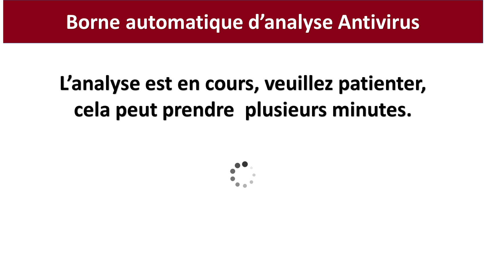
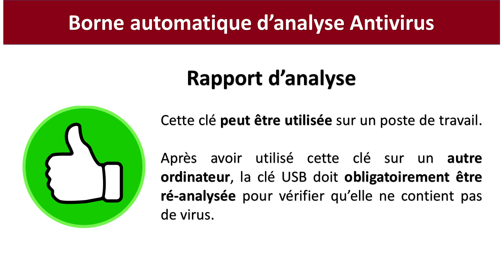

Pandora-box
============

Pandora-Box is a USB scaning station based on [Pandora](https://github.com/pandora-analysis), 
a malware analysis tool. 

Pandora-box uses these malware analysis tools :

- [ClamAV](http://www.clamav.net/) an open-source antivirus engine for detecting trojans, viruses, malware & other malicious threats.
- [Commodo Antivirus](https://antivirus.comodo.com/) the free version of Comodo Antivirus.
- [Hashllokup](https://circl.lu/services/hashlookup/) a public API to lookup hash values against known database of files. 
- [Yara Rules](https://github.com/Neo23x0/signature-base), the YARA signature and IOC database for  [LOKI](https://github.com/Neo23x0/Loki) and [THOR Lite](https://www.nextron-systems.com/thor-lite/) scanners.

Other tools may be used by configuring Pandora [antivirus-workers](https://github.com/pandora-analysis/pandora#antivirus-workers)

It runs on [Ubuntu 22.04 server LTS](https://releases.ubuntu.com/jammy/).

## Interface

It has a graphic user interface :

and a text user interface for advanced users :

## Roadmap

If you want to contribute, we have a [roadmap](ROADMAP.md).

## Installation

The [installation and configuration procedure](INSTALL.md) is documented.

## License

Pandora-box is an open source software distributed under [GPL](https://www.gnu.org/licenses/licenses.html).

