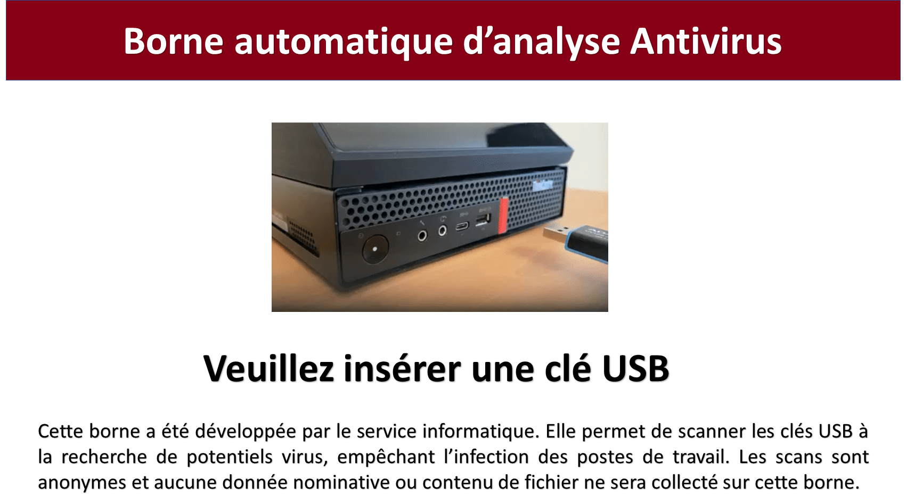
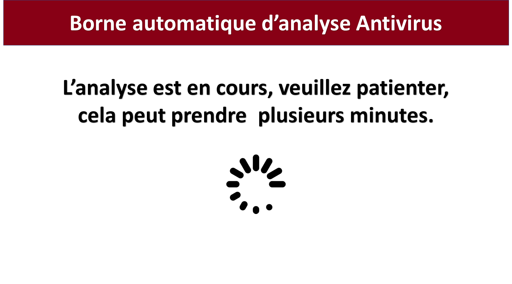
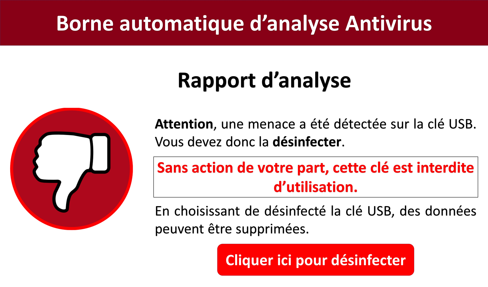

Pandora-box
============

Pandora-Box is a USB scaning station based on [Pandora](https://github.com/pandora-analysis).
It runs on Ubuntu 22.04 server LTS

It is based on recycled ThinkCenter and an integrated HDMI touch screen.

## Interface

It has a graphic user interface :

and a text user interface for advanced users :

## Roadmap

If you want to contribute, we have a [roadmap](ROADMAP.md).

## Installation

The [installation and configuration procedure](INSTALL.md) is documented.

## License

Pandora-box is an open source software distributed under [GPL](https://www.gnu.org/licenses/licenses.html).

