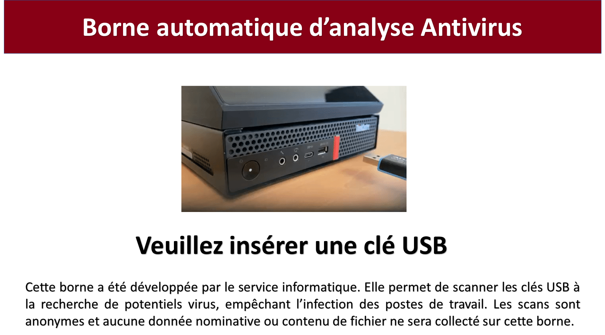
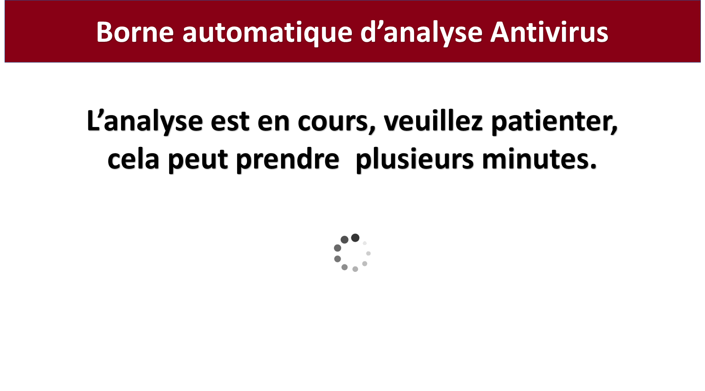
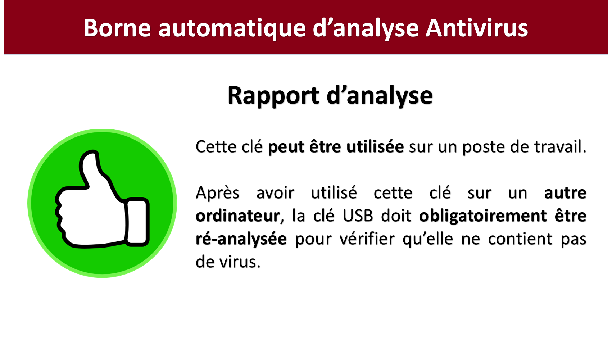
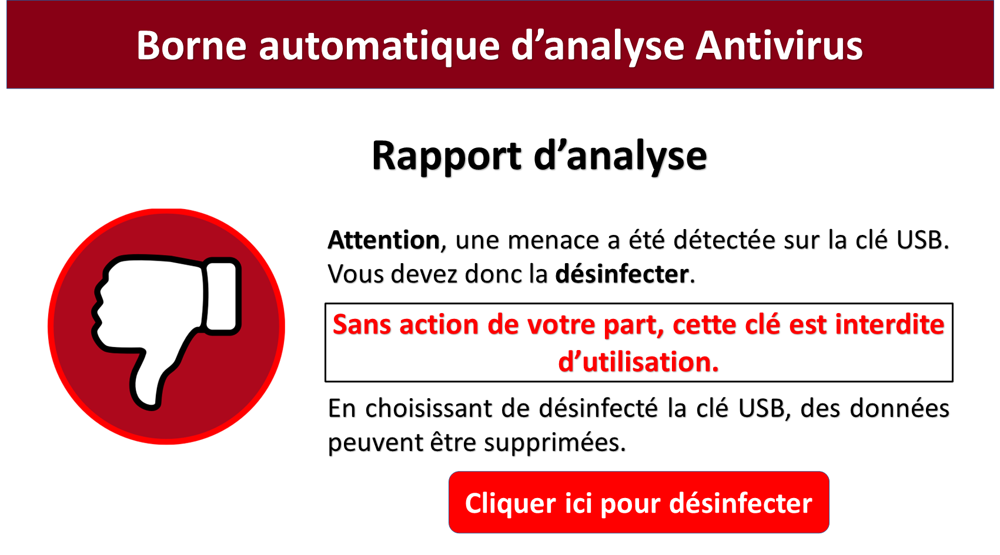
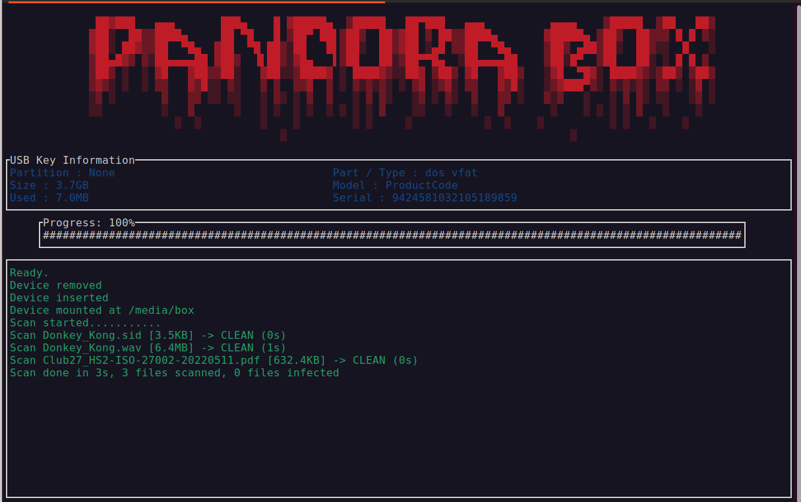

# PandoraBox

PandoraBox is a USB scanning station designed to detect and remove malware from USB disks. It is based on [Pandora](https://github.com/pandora-analysis) by [CIRCL](https://www.circl.lu) and is distributed under the [GPLv3 license](https://www.gnu.org/licenses/licenses.html).

## Key Features

- Detects USB insertion/removal in real time
- Automatically or manually mounts USB devices
- Multithreaded scanning using [pypandora](https://github.com/pandora-analysis/pypandora)
- Automatic quarantine of infected files
- Manual file removal after user confirmation
- Interactive terminal interface (curses) or graphical feedback using images
- Uses well-known malware detection tools:
  - [ClamAV](http://www.clamav.net/)
  - [Comodo Antivirus](https://antivirus.comodo.com/)
  - [Hashlookup](https://circl.lu/services/hashlookup/)
  - [Yara Rules](https://github.com/Neo23x0/signature-base)

Other malware detection tools can be configured using [Pandora antivirus-workers](https://github.com/pandora-analysis/pandora#antivirus-workers).

## Interface

PandoraBox supports:

### Graphical Feedback

[](images/key1.png)
[](images/wait1.png)
[](images/ok.png)
[](images/bad.png)

### Text Interface (Advanced Users)

[](images/pandora-curses.png)

## Installation

PandoraBox runs on [Ubuntu 24.04 server LTS](https://ubuntu.com/download/server).

### Dependencies

- Python 3.8+
- Python modules: `psutil`, `pyudev`, `pypandora`, `curses`, `logging`, `subprocess`

Install dependencies:

```bash
pip install psutil pyudev pypandora
```

### Configuration

Edit `pandora-box.ini` at the root of the project:

```ini
[DEFAULT]
; Curses mode (full text)
CURSES = False

; Set USB_AUTO_MOUNT to True is if the OS automaticaly mount USB keys
USB_AUTO_MOUNT = False

; Set PANDORA_ROOT_URL to the URL of the Pandora server
; the default value is "http://127.0.0.1:6100"
PANDORA_ROOT_URL = http://127.0.0.1:6100

; Set FAKE_SCAN to true to fake the scan process (used during developement only)
FAKE_SCAN = False

; Set to true to copy infected files to the quarantine folder
; in the USB scanning station
QUARANTINE = True

; Set quarantine folder
QUARANTINE_FOLDER = /var/quarantine

; Number of threads used by Pandora
THREADS = 8

; Max File Size (1G)
MAX_FILE_SIZE = 1080000000
```

### Setup & Usage

More details in the [installation guide](INSTALL.md).

## Application States

- `START`: Initialization and config loading
- `WAIT`: Wait for USB insertion
- `SCAN`: Scan device contents
- `CLEAN`: Prompt for infected file removal
- `STOP`: Application ends or error

## Roadmap

If you'd like to contribute, check the [roadmap](ROADMAP.md).

## Architecture

PandoraBox is implemented as a Python class (`PandoraBox`) which handles:

- Configuration parsing
- Device detection with `pyudev`
- File scanning using `pypandora`
- Logging and progress tracking
- Interactive interface handling

## Security and Customization

- Uses a system lock to prevent multiple instances
- Can be integrated with additional tools or security measures
- Easily extendable to new malware detection engines or logging systems

## Author

- Didier Barzin — [@dbarzin](https://github.com/dbarzin)

## License

PandoraBox is open source software released under the [GPLv3 license](https://www.gnu.org/licenses/licenses.html).
